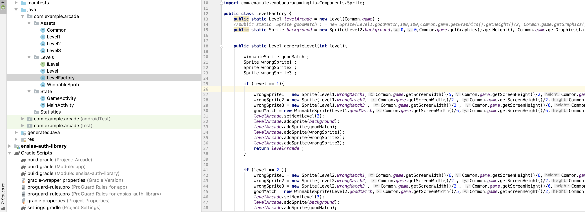
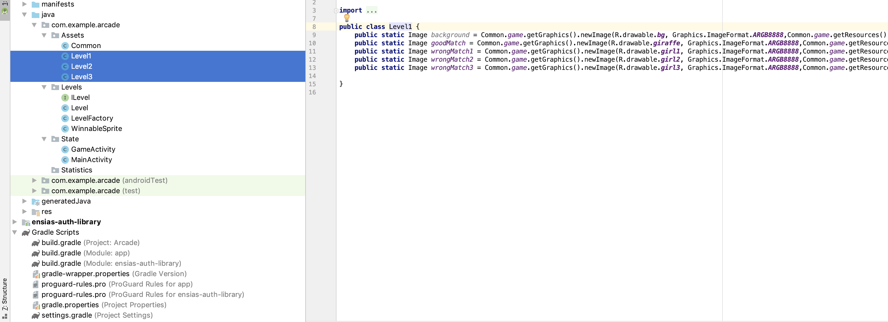
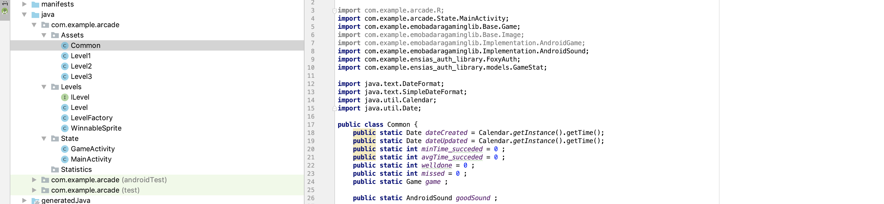
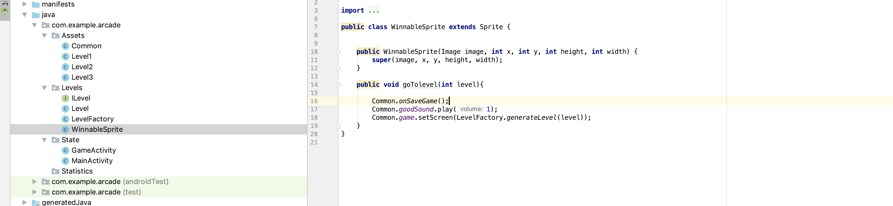
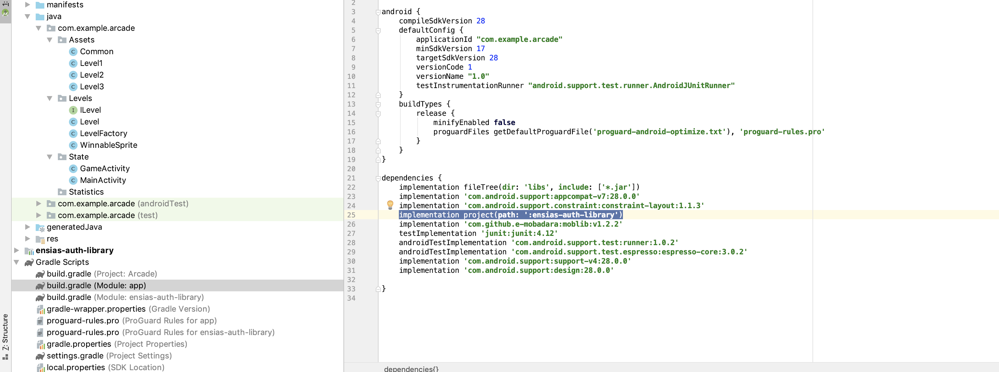
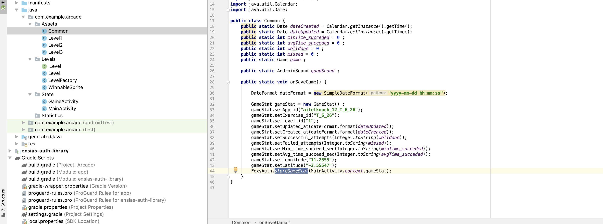
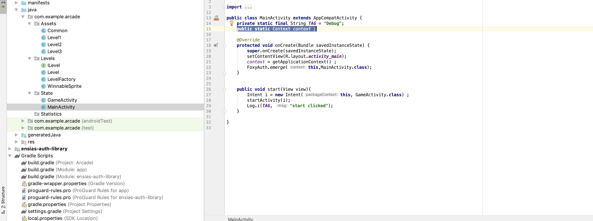

# Rapport Technique Android

## Problème 1

* Lorsqu'il y a plus d'un screen dans le jeu l'application se crache

## Solution 1

* On utilise la version 1.2.2 de e-mobadara
* on utilise le design pattern factory qui va nous permettre d'instancier un screen et de le supprimer lorsqu'on pass à un autre screen .

## Problème 2

* Si on crée chaque niveau à part et on lui affecte ses ressources (sprites + sons de rasmouki ) on se trouve avec du spakiti code  . Géneralement on ne pourra jamais dépasser plus de deux screens de cette manière .

## Solution 2

* On utilise le design pattern factory + des classes de niveaux contenants des réferences statiques aux ressources de l'application .

## Problème 3 

 * On doit optimiser l'usage de la mémoire en allouant le son de victoire les ressources communes une seule fois .

## Solution 3

 * On crée la classe Common contenant les ressources statiques communes et importantes comme gane de la classe Game .
 
## Problème 4
 
 * Il y a des sprites particuliers qui ne sont pas comme les autres . lorsqu'on clique dessus on doit entendre un éloge et passer au prochain niveau

## Solution 4

 * On crée une nouvelle classe **WinnableSprite** qui hérite de Sprite afin dela différencier par rapport aux aux autres sprites . Et lorsqu'on clique dessus on pourra sauvegarder le jeu et passer au niveai suivant .

## Problème 5

 * Implementation de la bibliothèque foxy-auth

## Solution 5

 * Cela m'a gaspillé beacoup de temps due à une erreur dans la documentation de la bibliothèque . J'ai fini par l'implémenter manuellement et créer un tutoriel vidéo en Facebook pour aider mes camarades 

 

## Problème 6

 * on doit faire en sorte qu'on peut sauvgarder l'avancement du jeu à chaque screen , non seulement dans la main activity .

 ## Solution 6

 * J'ai utilisé une solution tricky pour contourner le problème vu que la méthode storeGameStat a besoin d'un objet de type Context qu'on ne peut l'avoir qu'à l'intérieur d'une classe héritant de Activity .Ceci était possible grâce à l'aspect statique de java .

 

 